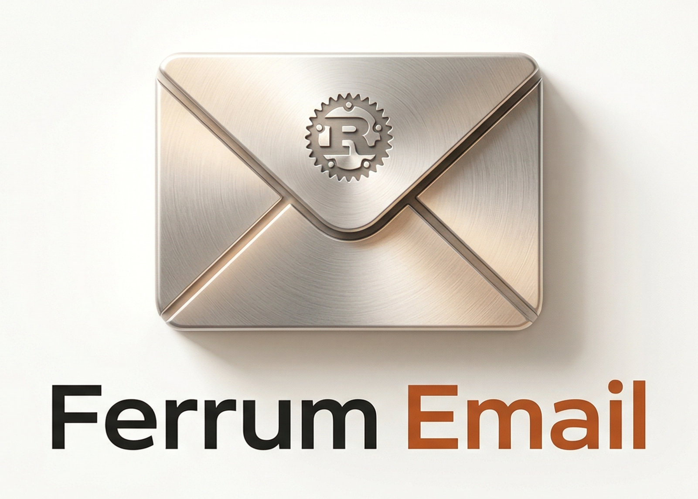

<p align="center">
  
</p>

<h1 align="center">Ferrum Email</h1>

<p align="center">
  <strong>Component-based email framework for Rust</strong><br>
  Type-safe templates. Cross-client rendering. Unified sending API.
</p>

<p align="center">
  <a href="https://github.com/AutomataNexus/FerrumEmail/actions/workflows/ci.yml"></a>
  <a href="https://crates.io/crates/ferrum-email-core"></a>
  <a href="https://docs.rs/ferrum-email-core"></a>
  <a href="https://github.com/AutomataNexus/FerrumEmail/blob/master/LICENSE-MIT"></a>
  
</p>

<p align="center">
  The Rust equivalent of <a href="https://react.email">React Email</a> + <a href="https://resend.com">Resend</a>.<br>
  Write email templates as composable Rust structs with typed props.<br>
  Render to email-safe HTML with inlined CSS. Send through any provider with one async call.
</p>

---

## Quick Start

```toml
[dependencies]
ferrum-email-core       = "0.1"
ferrum-email-components = "0.1"
ferrum-email-send       = "0.1"
```

```rust
use ferrum_email_components::*;
use ferrum_email_core::Component;
use ferrum_email_send::{Sender, providers::ConsoleProvider};

struct HelloEmail { name: String }

impl Component for HelloEmail {
    fn subject(&self) -> Option<&str> { Some("Hello!") }

    fn render(&self) -> Node {
        Html::new()
            .child(Body::new()
                .child(Container::new().child(
                    Text::new(&format!("Hello, {}!", self.name))
                        .font_size(Px(16))
                )))
            .into_node()
    }
}

#[tokio::main]
async fn main() -> anyhow::Result<()> {
    let sender = Sender::new(ConsoleProvider::new(), "me@example.com");
    sender.send(&HelloEmail { name: "World".into() }, "recipient@example.com").await?;
    Ok(())
}
```

That's it. No boilerplate. No configuration files. No HTML strings.

## Why Ferrum Email?

| Capability | React Email (JS) | lettre (Rust) | mrml (Rust) | **Ferrum Email** |
|-----------|-----------------|---------------|-------------|------------------|
| Component-based templates | Yes | No | No | **Yes** |
| Type-safe props | TypeScript | No | No | **Rust types** |
| Cross-client compatibility | Yes | No | Via MJML | **Yes** |
| Plain text auto-generation | Yes | Manual | No | **Yes** |
| Multi-provider sending | Via Resend | SMTP only | N/A | **Yes** |
| Compile-time validation | No | No | No | **Yes** |
| Zero external runtime | No (Node) | Yes | Yes | **Yes** |
| Secure credential vault | No | No | No | **Yes** (NexusVault) |

## Core Concepts

### Templates are Rust structs

```rust
pub struct WelcomeEmail {
    pub name: String,
    pub verify_url: String,
}

impl Component for WelcomeEmail {
    fn subject(&self) -> Option<&str> {
        Some("Welcome!")
    }

    fn render(&self) -> Node {
        Html::new()
            .child(Head::new())
            .child(Body::new().background(Color::hex("f6f6f6")).child(
                Container::new().max_width(Px(600)).child(
                    Section::new().padding(Spacing::all(Px(32)))
                        .child_node(Heading::h1(&format!("Welcome, {}!", self.name))
                            .color(Color::hex("1a1a1a")).into_node())
                        .child_node(Button::new(&self.verify_url, "Verify Email")
                            .background(Color::hex("C0392B"))
                            .text_color(Color::white())
                            .into_node())
                )))
            .into_node()
    }
}
```

### Components compose naturally

```rust
struct EmailFooter { company: String }

impl Component for EmailFooter {
    fn render(&self) -> Node {
        Section::new()
            .background(Color::hex("f0f0f0"))
            .child_node(Text::new(&self.company)
                .font_size(Px(12))
                .color(Color::hex("aaa"))
                .into_node())
            .into_node()
    }
}

// Use in any template:
Body::new()
    .child(/* main content */)
    .child_node(EmailFooter { company: "Acme Inc".into() }.render())
```

### All CSS is inlined automatically

Gmail strips `<style>` blocks. Ferrum inlines everything:

```rust
Text::new("Hello")
    .color(Color::hex("333"))
    .font_size(Px(16))
    .line_height(1.6)
// -> <p style="color:#333333;font-size:16px;line-height:1.6">Hello</p>
```

### Table-based layouts for Outlook

Outlook uses the Word rendering engine. Ferrum's components handle this automatically:

```rust
// Developer writes:
Button::new("https://example.com", "Click Me")
    .background(Color::hex("C0392B"))

// Renderer produces table-based HTML that works in Outlook:
// <table role="presentation" cellpadding="0" cellspacing="0">
//   <tbody><tr><td style="background-color:#C0392B;border-radius:4px;padding:12px 20px">
//     <a href="https://example.com" style="color:#ffffff;text-decoration:none">Click Me</a>
//   </td></tr></tbody>
// </table>
```

### Secure credential storage with NexusVault

Store email provider API keys and SMTP credentials encrypted at rest:

```toml
ferrum-email-send = { version = "0.1", features = ["vault"] }
```

```rust
use ferrum_email_send::vault::VaultCredentialStore;

let store = VaultCredentialStore::new(vault);
store.set_api_key("re_abc123_my_resend_key")?;
store.set_smtp_credentials("user@example.com", "password", "smtp.example.com", 587)?;

// Later, retrieve securely:
let api_key = store.get_api_key()?;
```

All secrets are encrypted with AES-256-GCM via [NexusVault](https://github.com/AutomataNexus/NexusVault).

## Available Components

| Component | Purpose |
|-----------|---------|
| `Html` | Root `<html>` with lang and dir |
| `Head` | Meta charset, viewport, title |
| `Body` | Background color, base font |
| `Preview` | Inbox preview text (hidden) |
| `Container` | Centered max-width wrapper |
| `Section` | Full-width section |
| `Row` | Multi-column row |
| `Column` | Table column with width |
| `Text` | Paragraph with typography |
| `Heading` | H1-H6 with size presets |
| `Button` | CTA button (Outlook-safe) |
| `Link` | Anchor with styling |
| `Image` | Image with required dimensions |
| `Hr` | Horizontal divider |
| `Code` | Inline code |
| `CodeBlock` | Code block |
| `Spacer` | Vertical whitespace |

## Crate Structure

| Crate | Purpose |
|-------|---------|
| [`ferrum-email-core`](crates/ferrum-email-core/) | Component trait, Node tree, Style system, types |
| [`ferrum-email-components`](crates/ferrum-email-components/) | Standard component library |
| [`ferrum-email-render`](crates/ferrum-email-render/) | HTML renderer, CSS inliner, plain text extractor |
| [`ferrum-email-send`](crates/ferrum-email-send/) | Provider abstraction, Sender, ConsoleProvider, Vault |
| [`ferrum-email-preview`](crates/ferrum-email-preview/) | Live preview server (Phase 2) |
| [`ferrum-email-macros`](crates/ferrum-email-macros/) | `email!` proc macro (Phase 3) |
| [`ferrum-email-cli`](crates/ferrum-email-cli/) | CLI binary (Phase 2/3) |

## Testing

```bash
cargo test --workspace                 # Run all 44 tests
cargo run -p example-welcome           # Run welcome email example
cargo run -p example-password-reset    # Run password reset example
```

## License

Dual-licensed under [MIT](LICENSE-MIT) or [Apache-2.0](LICENSE-APACHE).

## Author

Andrew Jewell Sr. — [AutomataNexus LLC](https://automatanexus.com) — devops@automatanexus.com
